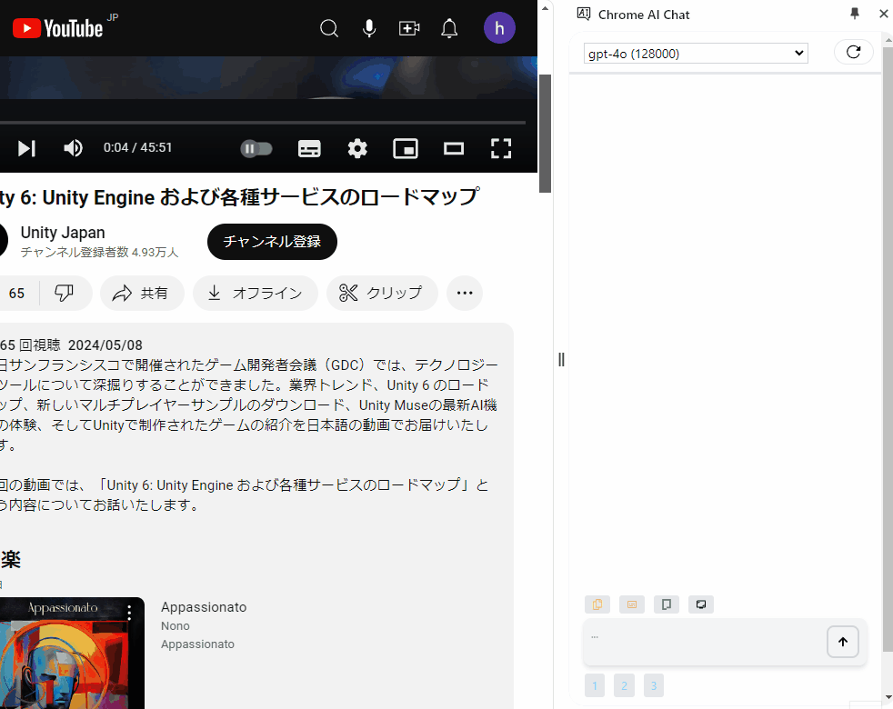
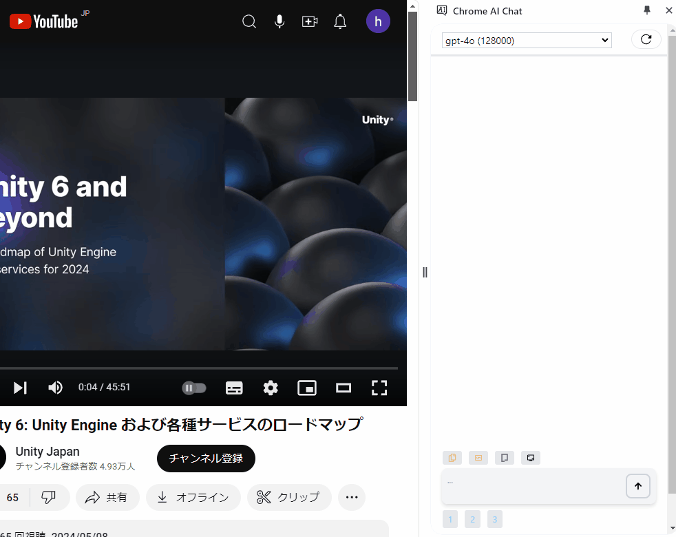
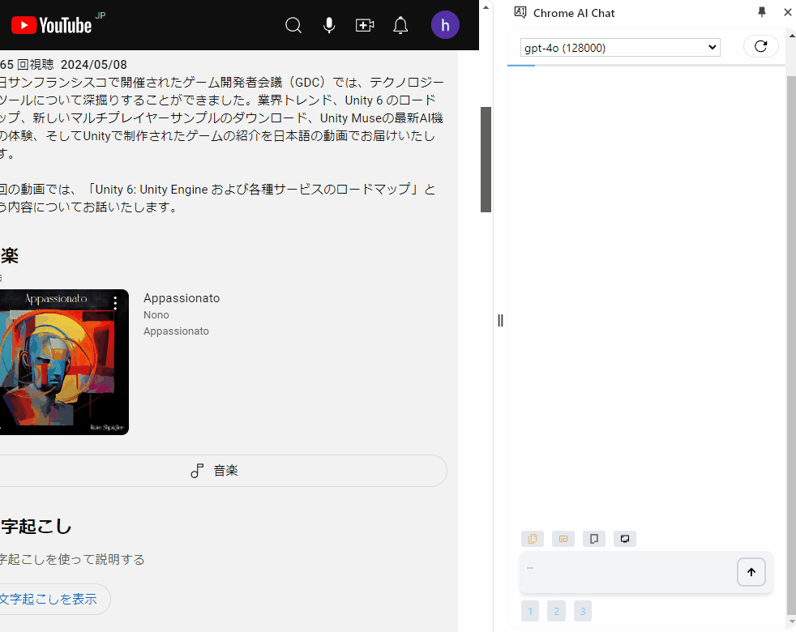
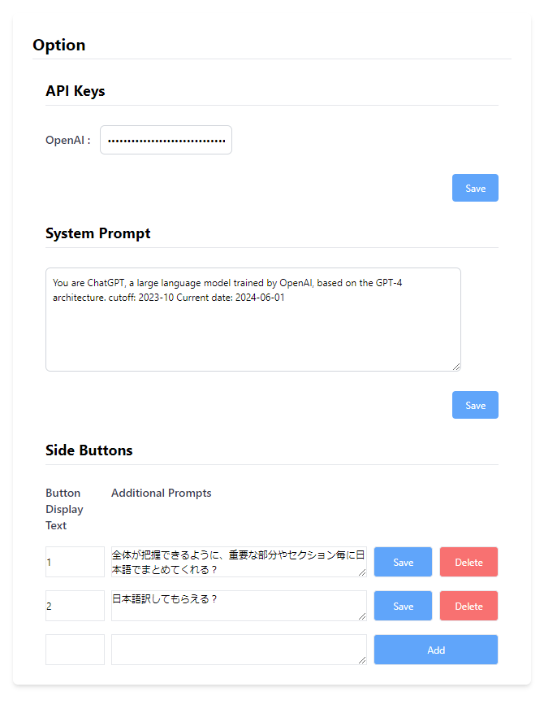

[日本語](#日本語) | [English](#english)
#### english
# Chrome Extension - SidepanelLLM

A Chrome extension that allows you to use AI Chat in the Chrome sidepanel. Currently, it only supports the OpenAI API.

I made this because I prefer knowing what prompts are being used.

 

You can insert selected text into the form and chat with it.

 

When you open a YouTube video page and press the button, you can use the subtitle information of the video to chat. This is useful for understanding the summary of the video.

You can drag and drop images to chat using the images.

There are also features to take screenshots of the screen and insert prompts with a button.

### Requirements

* OpenAI API key and usage fees

### Current Features

* Insert selected text on the screen with a button
* Insert subtitle information from YouTube videos with a button
* Insert all text information from the page with a button
* Insert a screenshot of the screen with a button
* Insert simple prompts with a button

### Limitations

* Cannot read videos or PDFs
* No audio-related features
* Cannot use other AIs like Google's Gemini
* No history functionality

and more...

### Boilerplate Used - Thanks
[Chrome Extension Boilerplate with React + Vite + TypeScript](https://github.com/Jonghakseo/chrome-extension-boilerplate-react)

## Usage

1. Download the dist.zip file from the [release](https://github.com/opvelll/SidepanelLLM/releases/tag/v0.8.0-alpha.2) on GitHub, and unzip it.

2. Launch Chrome, go to manage extensions, and load the unpacked extension by selecting the unzipped folder.

3. After installation, right-click the extension button in the top right corner and open options.

4. Set the API key issued by OpenAI in the API Key field in the options. To prevent key theft, it is recommended to set a limit on the API key.

## Screen Buttons

You can chat from the form at the bottom of the screen.
When you press the buttons above the form, you can embed information from the currently open tab into the form.
From the left, the buttons allow you to insert the selected text, subtitle information from YouTube videos, all text information from the page, and a screenshot of the screen.

## License

[LICENSE.md](LICENSE.md)

#### 日本語
# Chrome Extension - SidepanelLLM

Chrome のサイドバーでAI Chatができるようになる拡張機能です。現在OpenAIのAPIのみ対応。

どういうプロンプトを入れているかわかりやすいほうが好みなので作りました。

 

ドラッグ選択した文章をフォームに差し込んで会話できます。

 

Youtubeの動画ページを開いてボタンを押すと、動画の字幕情報を使って会話できます。動画の概要なんかを把握するのに使えます。

画像をドラッグアンドドロップで、画像を使って会話できます。

また他にも画面のスクリーンショットを撮る機能、プロンプトをボタンで差し込む機能があります。

### 使うのに必要なもの

* OpenAIのAPIキーとその使用料金

### 現在できること

* 画面上でドラッグした部分をボタンで挿入
* 動画の字幕情報をボタンで挿入
* 画面全体の文字情報をボタンで挿入
* 画面のスクリーンショットをボタンで挿入
* 簡単なPromptをボタンで挿入

### できないこと

* 動画とかpdfの読み込み
* 音声関連の機能
* GoogleのGeminiなど他のAIの使用
* 履歴機能

等々

### 使用ボイラープレート ありがとう
[Chrome Extension Boilerplate with React + Vite + TypeScript](https://github.com/Jonghakseo/chrome-extension-boilerplate-react-vite)

## 使い方

1. githubの[release](https://github.com/opvelll/SidepanelLLM/releases/tag/v0.8.0-alpha.2)からdist.zipファイルをダウンロード、解凍。

2. Chromeを立ち上げ、拡張機能を管理へ、パッケージ化されていない拡張機能を読み込むで解凍先ファルダを指名。

3. インストールされた後、右上拡張のボタンを右クリック、オプションを開く

4. オプションのAPI KeyにOpen AIで発行したAPIキーを設定する。キーの盗難に備え、APIキーには上限を設定することをお勧めします。

## 画面のボタン

画面下のフォームからチャットができます。
フォーム上部のボタンを押すと、現在開いているタブから情報をフォームに埋め込むことができます。
ボタンは左から、選択部分、Youtube動画の字幕情報、ページ全体のテキスト情報、スクリーンショットを取得できます。

## License

[LICENSE.md](LICENSE.md)